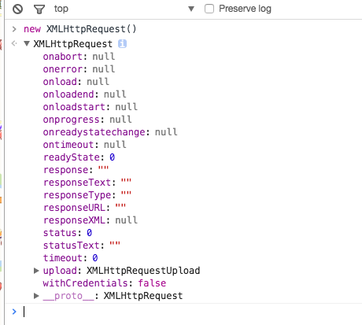

# Ajax

Ajax 全称 Asynchronous JavaScript and XML, 即异步JS与XML. 它最早在IE5中被使用, 然后由Mozilla, Apple, Google推广开来

## XMLHttpRequest

标准浏览器通过**XMLHttpRequest**对象实现了ajax的功能，IE浏览器通过**XMLHttpRequest**或者**ActiveXObject**对象同样实现了ajax的功能

```
<!-- model browser -->
var xhr = new XMLHttpRequest();
<!-- IE -->
var xhr = new ActiveXObject("Msxml2.XMLHTTP");// 即MSXML3
var xhr = new ActiveXObject("Microsoft.XMLHTTP");// 很老的api,虽然浏览器支持,功能可能不完善,故不建议使用
```

### XML属性



XMLHttpRequest 实例对象没有自有属性. 实际上, 它的所有属性均来自于`XMLHttpRequest.prototype`，实际的继承关系是

`xhr`<<`XMLHttpRequest.prototype`<<`XMLHttpRequestEventTarget`<<`EventTarget`<<`Object`

#### readyState

只读属性，改变它的值是不可行的

|readyState|对应常量             |描述                                        |
|:---------|:------------------:|------------------------------------------:|
|0(未初始化)|xhr.UNSENT          |请求已建立，但未初始化(未调用open方法)           |
|1(初始化)  |xhr.OPENED          |请求已建立，但未发送(以调用open，但未调用send方法)|
|2(发送数据)|xhr.HEADERS_RECEIVED|请求已发送 (send方法已调用, 已收到响应头)        |
|3(数据传送中)|xhr.LOADING       |请求处理中，因响应内容不全，这时通过responseBody和responseText获取可能会出错|
|4(完成)   |xhr.DONE            |数据接收完毕，此时可通过responseBody和responseText获取完整响应数据|

#### onreadystatechange

**onreadystatechange**事件回调方法在**readystate**状态改变时触发, 在一个收到响应的ajax请求周期中, **onreadystatechange**方法会被触发4次,**onreadystatechange**回调中默认会传入Event实例

#### status

只读属性, status表示http请求的状态, 初始值为0. 如果服务器没有显式地指定状态码, 那么status将被设置为默认值, 即200.

#### statusText

只读属性, statusText表示服务器的响应状态信息, 它是一个**UTF-16**的字符串, 请求成功且status==20X时, 返回大写的 OK . 请求失败时返回空字符串. 其他情况下返回相应的状态描述. 比如: 301的**Moved Permanently**,**302的 Found**,**303的 See Other**,**307 的 Temporary Redirect**,**400的 Bad Request**,**401的 Unauthorized**等等

#### onloadstart

onloadstart事件回调方法在ajax请求发送之前触发, 触发时机在**readyState==1**状态之后,**readyState==2**状态之前

onloadstart方法中默认将传入一个ProgressEvent事件进度对象

##### ProgressEvent

ProgressEvent对象具有三个重要的Read only属性

* lengthComputable 表示长度是否可计算，他是一个布尔值，初始值为false
* loaded 表示意境记载的资源大小，如果使用http下载资源部，他仅仅表示已下载内容的大小，而不包括**http headers**等，是一个无符号长整型，初始值为0
* total 表示资源总大小，如果使用http下载资源部，他仅仅表示内容的总大小，而不包括**http headers**等，是一个无符号长整型，初始值为0

#### onprogress

onprogress事件回调方法在**readyState==3**状态时开始触发, 默认传入**Progressvent**对象, 可通过**e.loaded/e.total**来计算加载资源的进度, 该方法用于获取资源的下载进度.

#### onload

onload事件回调方法在ajax请求成功后触发, 触发时机在**readyState==4**状态之后.

#### onloadend

onloadend事件回调方法在ajax请求完成后触发, 触发时机在**readyState==4**状态之后(收到响应时) 或者**readyState==2**状态之后(未收到响应时).

#### timeout

timeout属性用于指定ajax的超时时长. 通过它可以灵活地控制ajax请求时间的上限. timeout的值满足如下规则:

* 通常设置为0时不生效
* 设置为字符串时，如果字符串中全部为数据，会自动转换，反之则该被配置不生效
* 设置为对象时，如果该对象能够转化数字，反之不生效

```
xhr.timeout = 0; //不生效
xhr.timeout = '123'; //生效, 123
xhr.timeout = '123s'; //不生效
xhr.timeout = ['123']; //生效, 123
xhr.timeout = {a:123}; //不生效
```

#### ontimeout

ontimeout方法再**ajax**请求超时时出发，通过它可以在**ajax**请求超时时做一些后续处理

#### response/responseText

只读属性，response表示服务器响应内容，相应的，responseText表示服务器响应内容的文本形式

#### responseXML

只读属性，responseXML表示xml形式的响应数据，缺省值为null, 若数据不是有效的xml，则会报错

#### responseType

表示响应的类型，可取`arraybuffer`, `blob`, `document`, `json`, and `text`五种类型

#### responseURL

返回ajax请求最终的URL，如果请求中存在重定向，那么**responseURL**表示重定向后的URL

#### withCredentials

一个布尔值，默认为false，表示跨域请求中不乏送**cookies**等信息，当他设置为true时，`cookies`, `authoriztion headers` or `TLS客户端证书`都可以正常发送和接收

#### abort

方法用于取消ajax请求，取消后**readystate**状态将被设置为0

#### getResponseHeader

方法用于获取ajax响应头中指定name的值，如果**response headers**中存在相同的name，那么它们的值降自动以字符串的形式连接在一起

#### getAllResponseHeaders

方法用于获取所有安全的ajax响应头，响应头以字符串的形式返回. 每个HTTP报头名称和值用冒号分割，如key:value并以\r\n结束

`readystate === 2`状态时，才能打印出完整的响应头

#### setRequestHeader

设置ajax请求头

#### onerror

方法用于在ajax请求出错后执行，通常只在网络出现问题时或者ERR_CONNECTION_RESET时触发

#### upload

属性默认返回一个`XMLHttpRequest`对象，用于上传资源，方法有:

* onloadstart
* onprogress
* onabort
* onerror
* onload
* ontimeout
* onloadend

上述方法功能同 xhr 对象中同名方法一致. 其中, onprogress 事件回调方法可用于跟踪资源上传的进度

#### overrideMimeType

方法用于强制指定response的MIME类型，即强制修改`Content-Type`


## ajax有没有破坏js单线程机制

浏览器有如下四种线程:

* GUI渲染线程
* javascript引擎线程
* 浏览器事件触发线程
* HTTP请求线程

通常, 它们的线程间交互以事件的方式发生, 通过事件回调的方式予以通知. 而事件回调, 又是以先进先出的方式添加到**任务队列**的末尾 , 等到js引擎空闲时, **任务队列**中排队的任务将会依次被执行. 这些事件回调包括 setTimeout, setInterval, click, ajax异步请求等回调

浏览器中, js引擎线程会循环从**任务队列**中读取事件并且执行, 这种运行机制称作**Event Loop (事件循环)**

当**ajax**请求被服务器响应并且收到**response**后, 浏览器事件触发线程捕获到了**ajax**的回调事件**onreadystatechange**(当然也可能触发onload, 或者 onerror等等) ，该回调事件并没有被立即执行, 而是被添加到**任务队列**的末尾. 直到js引擎空闲了, **任务队列**的任务才被捞出来, 按照添加顺序, 挨个执行, 当然也包括刚刚**append**到队列末尾的**onreadystatechange**事件

在**onreadystatechange**事件内部, 有可能对dom进行操作. 此时浏览器便会挂起**js引擎线程**, 转而执行**GUI渲染线程**, 进行**UI重绘(repaint)**或者**回流(reflow)**. 当js引擎重新执行时, **GUI渲染线程**又会被挂起, **GUI更新**将被保存起来, 等到js引擎空闲时立即被执行.

以上整个**ajax**请求过程中, 有涉及到浏览器的4种线程. 其中除了**GUI渲染线程**和**js引擎线程**是互斥的. 其他线程相互之间, 都是可以并行执行的. 通过这样的一种方式, **ajax**并没有破坏js的单线程机制

## ajax与setTimeout排队问题

通常,**ajax**和**setTimeout**的事件回调都被同等的对待, 按照顺序自动的被添加到**任务队列**的末尾, 等待**js引擎**空闲时执行. 但并非**xhr**的所有回调执行都滞后于**setTImeout**的回调

实际上, 一次**ajax**请求, 并非所有的部分都是异步的, 至少"readyState==1"的**onreadystatechange**回调以及**onloadstart**回调就是同步执行的


